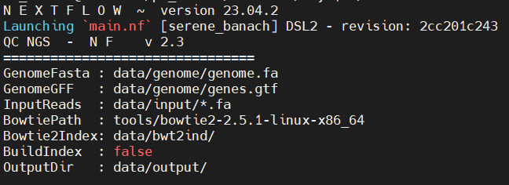

# sgRNA processing and characterization
sgRNA characterization

## Important folders
To run it smoothly we need below folder structure, git clone should do the job.
### Project structure
> - **main.nf** (pipeline script)
> - **sgRNA_alignment.nf** (pipeline processes)
> - **sgRNA_processing.py** (script to process aligned sam file)
> - **nextflow.config** (configuration file for processes)
> - **Dockerfile** (file to build docker image)
>   - **data** (folder)
>     - **input** (folder with query .fa files)
>     - **genome** (folder holds .gtf and .fa from ref genome)
>     - **bwt2ind** (bowtie2 index will be created inside)
>     - **output** (folder to store all the results)
>       - **xyz.sam** (bowtie2 alignment)
>       - **xyz.sam-bowtie2.log** (bowtie2 alignment stat)
>       - **xyz.sam_final_df.tsv** (sam result file with mapped gene annotation and joined with TCGA FPKM gene expression)
>       - **xyz.sam_summary.json** (Some statistics on the results)
>       - **un-seqs** (sequences those were not aligned)
>     - **TCGA** (folder with each project has one folder with expression data inside)
>   - **tools** (folder has tools used in analysis)

## How to run the pipeline (Included results are generated using GRCh38)
After cloning the repository, 
- add genome fasta (.fa) and gene annotation file (.gtf) from the reference genome in the genome 
folder 
- put your sequences to analyzed in the input folder. 
- if needed add more gene expression data in the TCGA folder

If the overall structure is maintained then we don't have to do a lot. One **important thing is that we mount local directory 
data as /app/data** when running with docker. This is important, so we don't have to create very large images but of course that can also be done. 
Following are the parameters needed for the run.

### Inside/With Docker container
 After that we can start the pipeline. Let's build the image first. Goto the sgRNA directory and run following command.
 
`docker build -t sgrna:version`

Once the docker image is created we can run the pipeline. However, instead of loading all the indexes and genome file 
loading into docker we just map the folder with **-v**.

#### Insider docker container

###### Without bowtie2index
`docker run 
-rm -v /local/folder/with/project/and/files:/app/data sgrna:version ./nextflow -c nextflow.config main.nf --buildind=true`

###### With bowtie2index

`docker run 
-rm -v /local/folder/with/project/and/files:/app/data sgrna:version ./nextflow main.nf`

This shall produce the files in the data/output folder.

#### With docker container

You can use docker container with versioned tools to run the pipeline, and same as before for with or witout bowtie2index. 

`./nextflow -c nextflow.config main.nf -with-docker sgrna:version`

### Without docker container

Our pipeline is not that complicated so we can also run it normally but for that you need to download and install nextflow.
Afterward, we can run it normally. 

When you dont have an index:

`./nextflow -c nextflow.config main.nf --buildind=true`

or after creating it

`./nextflow -c nextflow.config main.nf`

## Result interpretation
Pipeline generates five output files as shown in the dir structure. Two more important files are:
- **xyz.sam_summary.json**: This file has an overview of sequence alignement and annotation match between given and found.
- **xyz.sam_final_df.tsv**: this file contains three different information
  - Chromosome, start, strand, & cigar information for the aligned sequence
  - Mapping of the aligned regio with annotation file (.gtf) and extract matched gene pos, and name.
  - Mapping of gene expression of mapped genes with TCGA data 